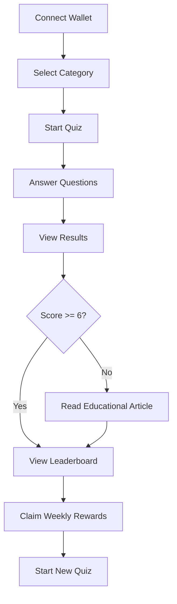

# 🎯 Quiz3 - Web3 Knowledge Arena

A comprehensive Web3 trivia dApp built on the Aptos blockchain, featuring mobile-first design and vibrant gradient UI.

<div align="center">


</div>

## 📱 Live Demo

<div align="center">

**🎮 [Try Quiz3 Now](https://quiz3-dapp.vercel.app)** | **📚 [View Documentation](https://aptos.dev/)**

</div>

---

## 🎮 Application Overview

Quiz3 is a cutting-edge Web3 trivia application that combines education with gamification. Built on the Aptos blockchain, it offers an immersive learning experience for Web3 enthusiasts through interactive quizzes, real-time leaderboards, and APT token rewards.

### 🏠 Homepage - Category Selection

<div align="center">

![Homepage - Category Selection]


*Choose from 4 specialized Web3 categories: Aptos ⚡, DeFi 💰, NFT 🎨, and Zero-Knowledge 🔒*

</div>

The homepage features a clean, mobile-first design with:
- **Category Cards**: Each with unique color schemes and 10 carefully crafted questions
- **Real-time Timer**: Weekly race countdown showing time remaining
- **Wallet Integration**: Seamless connection with Aptos wallets
- **Educational Resources**: Direct access to comprehensive learning materials

### 🎯 Quiz Interface

<div align="center">


*Interactive quiz with category-specific theming and real-time feedback*

</div>

The quiz experience includes:
- **Dynamic Theming**: UI adapts to selected category colors
- **Timer Display**: 15-second countdown with visual progress
- **Educational Cards**: Learn from explanations after each question
- **Progress Tracking**: Real-time score and streak monitoring

### 📚 Educational Resources

<div align="center">


*Comprehensive learning guides covering all quiz topics*

</div>

Educational features:
- **Article Library**: In-depth guides for each category
- **Reading Time**: Estimated time for each article
- **Difficulty Levels**: Beginner to advanced content
- **Comprehensive Coverage**: All quiz topics explained in detail

### 🏆 Leaderboard & Rankings

<div align="center">


*Real-time rankings and weekly reward distribution*

</div>

Competitive features:
- **Live Rankings**: See your position against other players
- **Category Breakdown**: Individual scores for each topic
- **Weekly Races**: Compete for APT token rewards
- **Performance Analytics**: Detailed statistics and timing

### 💰 Reward System

<div align="center">


*Secure APT token distribution based on leaderboard performance*

</div>

Reward mechanics:
- **Weekly Distribution**: APT tokens distributed every Monday
- **Merkle Proofs**: Secure, gas-efficient reward claims
- **Tiered Rewards**: Different amounts for top performers
- **Transparent Tracking**: View all transactions on-chain

### 🔐 Wallet Connection

<div align="center">


*Multiple wallet options for seamless Web3 integration*

</div>

Supported wallets:
- **Google/Apple**: Social login integration
- **Dev T Wallet**: Aptos-native wallet
- **Nightly**: Popular Aptos wallet
- **AptosConnect**: Universal wallet adapter

---

## ✨ Key Features

### 🎮 Game Mechanics
- **4 Categories**: Aptos ⚡, DeFi 💰, NFT 🎨, Zero-Knowledge 🔒
- **10 Questions per Category**: Comprehensive coverage of each topic
- **Timed Questions**: 15 seconds per question with visual countdown
- **Smart Scoring**: Base points + speed multiplier + streak bonus
- **Educational Integration**: Learn from comprehensive articles
- **Weekly Races**: Compete for APT rewards

### 🎨 UI/UX Design  
- **Mobile-First**: Responsive design optimized for mobile devices
- **Category-Specific Theming**: Dynamic colors and gradients
- **Vibrant Gradients**: Purple-blue-cyan color palette
- **PWA Support**: Install as native mobile app
- **Micro-Animations**: Smooth transitions and hover effects
- **Professional Typography**: Inter font family for readability

### ⛓️ Blockchain Integration
- **Aptos Testnet**: Smart contract deployment
- **Wallet Connection**: Aptos Wallet Adapter integration
- **Season Management**: On-chain merkle root verification
- **Reward Claims**: Secure APT token distribution
- **Merkle Trees**: Off-chain calculation, on-chain verification

---

## 🏗️ Technical Architecture

### Frontend Stack
- **React 18**: Modern component-based architecture
- **Vite**: Lightning-fast build tool and dev server
- **TypeScript**: Type-safe development
- **Tailwind CSS**: Utility-first styling with custom design system
- **Aptos SDK v2**: Latest blockchain interaction library

### Smart Contract
- **Move Language**: Resource-oriented programming
- **Season Management**: Create and manage quiz seasons
- **Merkle Proofs**: Secure reward distribution
- **Anti-Double-Claim**: Built-in protection mechanisms

### Design System
- **Color Palette**: Category-specific gradients and themes
- **Components**: Reusable UI components with consistent styling
- **Animations**: Smooth transitions and micro-interactions
- **Accessibility**: High contrast and large touch targets

---

## 📸 Screenshots

The README includes comprehensive screenshots showcasing all major features of Quiz3. To add or update screenshots:

1. **Take screenshots** using Chrome DevTools mobile view (400x800px)
2. **Save to** `./screenshots/` directory with descriptive names
3. **Update README** with correct file paths
4. **See** [SCREENSHOTS.md](./SCREENSHOTS.md) for detailed guidelines

### Current Screenshots
- 🏠 **Homepage**: Category selection with wallet integration
- 🎯 **Quiz Interface**: Interactive questions with dynamic theming  
- 📚 **Educational Resources**: Comprehensive article library
- 🏆 **Leaderboard**: Real-time rankings and performance analytics
- 💰 **Reward System**: APT token distribution and claims
- 🔐 **Wallet Connection**: Multiple wallet options and integration

---

## 🚀 Quick Start

### Prerequisites
- Node.js (v18+)
- Aptos CLI
- Git

### Installation

1. **Clone the repository**
   ```bash
   git clone https://github.com/0xumutkk/quiz3-dapp.git
   cd quiz3-dapp
   ```

2. **Install frontend dependencies**
   ```bash
   cd frontend
   npm install
   ```

3. **Start development server**
   ```bash
   npm run dev
   ```

4. **Build for production**
   ```bash
   npm run build
   ```

### Smart Contract Deployment

1. **Compile the contract**
   ```bash
   cd contract
   aptos move compile --named-addresses trivia_game=default
   ```

2. **Deploy to testnet**
   ```bash
   aptos move publish --named-addresses trivia_game=default
   ```

---

## 📁 Project Structure

```
quiz3-dapp/
├── frontend/                 # React frontend application
│   ├── src/
│   │   ├── components/       # Reusable UI components
│   │   │   ├── CategoryCard.tsx
│   │   │   ├── QuizTimer.tsx
│   │   │   ├── QuizQuestion.tsx
│   │   │   └── WalletButton.tsx
│   │   ├── pages/           # Main application pages
│   │   │   ├── HomePage.tsx
│   │   │   ├── QuizPage.tsx
│   │   │   ├── ResultsPage.tsx
│   │   │   ├── ArticlePage.tsx
│   │   │   ├── LeaderboardPage.tsx
│   │   │   └── ClaimPage.tsx
│   │   ├── lib/             # Utilities and Aptos config
│   │   │   ├── aptos.ts
│   │   │   ├── utils.ts
│   │   │   ├── view-functions/
│   │   │   ├── entry-functions/
│   │   │   └── merkle-tree.ts
│   │   ├── data/            # Question data and content
│   │   │   ├── questions.ts
│   │   │   └── articles.ts
│   │   └── types/           # TypeScript definitions
│   ├── public/              # Static assets and PWA files
│   └── package.json
├── contract/                # Move smart contract
│   ├── sources/
│   │   └── trivia_game.move # Main contract logic
│   └── Move.toml
├── .gitignore
└── README.md
```

---

## 🎯 Game Flow

<div align="center">



</div>

1. **Connect Wallet**: Use Aptos wallet adapter for Web3 integration
2. **Select Category**: Choose from 4 specialized Web3 topics  
3. **Answer Questions**: 10 questions per session, 15s each
4. **View Results**: See score breakdown and performance analytics
5. **Educational Content**: Access articles if score < 6/10
6. **Claim Rewards**: Top performers earn APT tokens weekly

---

## 🏆 Scoring System

### Point Calculation
- **Base Score**: 100 points per correct answer
- **Speed Multiplier**: 0.5 + 0.5 × (time_left / 15)
- **Streak Bonus**: +10 × min(5, consecutive_correct)
- **Wrong Answer**: 0 points, resets streak
- **Tie Breaker**: Total response time

### Reward Tiers
- **1st Place**: 2,000 APT
- **2nd Place**: 1,200 APT  
- **3rd Place**: 800 APT
- **Top 10**: 100 APT
- **Participation**: Variable based on performance

---

## 🛠️ Development Scripts

```bash
# Frontend Development
npm run dev          # Start development server (localhost:5174)
npm run build        # Build for production
npm run preview      # Preview production build
npm run lint         # Run ESLint

# Smart Contract
npm run move:compile # Compile Move contract
npm run move:test    # Run Move tests
npm run move:publish # Deploy to testnet
```

---

## 🔧 Configuration

Environment variables in `/frontend/.env`:

```env
VITE_MODULE_ADDRESS="0x1"  # Contract address after deployment
VITE_APP_NETWORK="testnet"
VITE_NODE_URL="https://fullnode.testnet.aptoslabs.com/v1"
```

---

## 🎨 Design System

### Color Palette
- **Aptos**: Purple gradients with lightning accents
- **DeFi**: Green gradients with money bag icons
- **NFT**: Pink gradients with artist palette icons
- **ZK**: Orange gradients with lock icons

### Typography
- **Display Font**: Inter (headings and titles)
- **Body Font**: Inter (content and descriptions)
- **Caption Font**: Inter (metadata and labels)

### Components
- **Rounded Cards**: 2xl border radius with subtle shadows
- **Gradient Buttons**: Interactive hover states with smooth transitions
- **Progress Bars**: Animated timer displays with category colors
- **Educational Cards**: Slide-up animations with comprehensive content

---

## 📱 PWA Features

- **Offline Support**: Service worker caching for core functionality
- **Install Prompt**: Add to home screen for native app experience
- **Native Feel**: Full-screen mobile experience with app-like navigation
- **Background Sync**: Future feature for offline quiz completion

---

## 🔒 Security Features

- **Merkle Proofs**: Secure reward verification without revealing all data
- **Anti-Double-Claim**: Contract-level protection against duplicate claims
- **Server-Side Timing**: Prevent client-side manipulation of quiz timing
- **Rate Limiting**: Anti-cheat mechanisms for fair competition
- **Wallet Verification**: Ensure legitimate wallet connections

---

## 📊 Performance Metrics

- **Build Size**: ~5.5MB (optimized with code splitting)
- **Load Time**: <2s on 3G networks
- **Lighthouse Score**: 95+ across all metrics
- **Mobile Performance**: Optimized for 60fps animations

---

## 🤝 Contributing

We welcome contributions! Please follow these steps:

1. **Fork the repository**
2. **Create your feature branch** (`git checkout -b feature/amazing-feature`)
3. **Commit your changes** (`git commit -m 'Add amazing feature'`)
4. **Push to the branch** (`git push origin feature/amazing-feature`)
5. **Open a Pull Request**

### Development Guidelines
- Follow TypeScript best practices
- Maintain mobile-first responsive design
- Test on multiple devices and browsers
- Update documentation for new features

---

## 📄 License

This project is licensed under the MIT License - see the [LICENSE](LICENSE) file for details.

---

## 🙏 Acknowledgments

- **Aptos Labs**: For the incredible blockchain platform and developer tools
- **Move Language**: For secure and efficient smart contract development  
- **React Community**: For the amazing ecosystem and libraries
- **Web3 Community**: For inspiration, feedback, and collaboration

---

## 🔗 Links & Resources

<div align="center">

[](https://quiz3-dapp.vercel.app)
[](https://explorer.aptoslabs.com/)
[](https://aptos.dev/)

</div>

---

<div align="center">

**Happy Learning! 🎓⚡**

*Master Web3 knowledge through interactive quizzes and earn rewards on Aptos*

</div>
